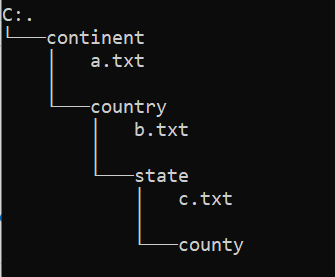
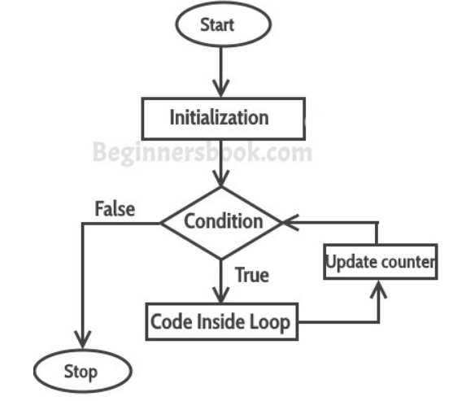

## Question 1 

Given:



```java
BiPredicate<Path, BasicFileAttributes> pred = (path, fileAttrs) -> {
    return fileAttrs.isDirectory();
};
int depth = 1;
try (var stream = Files.find(Paths.get("/continent"), depth, pred)) {
    stream.forEach(System.out::println);
} catch (IOException e) { 
    e.printStackTrace();
}
```
### References: 
[Files.find](https://docs.oracle.com/en/java/javase/11/docs/api/java.base/java/nio/file/Files.html#find(java.nio.file.Path,int,java.util.function.BiPredicate,java.nio.file.FileVisitOption...))

### Answer
// resources\continent
// resources\continent\country

---

## Question 2

Given
```java
    Consumer<String> c1 = arg -> System.out.println(arg);
    c1.accept("c1 accepted");
    Consumer<String> c2 = arg -> System.out.println(arg);
    c2.accept("c2 accepted");
    c2.andThen(c1).accept("after then");
    c2.accept("c2 accepted again");
```
### References

**The java.util.function.Consumer<T>** interface defines an abstract method named **accept** that takes an object of generic type T and returns no result (void).

```java
@FunctionalInterface
public interface Consumer<T> {
    void accept(T t);
}
```
method **andThen** returns a composed Consumer that performs, in sequence, for the current operation followed by the after operation.
```java
    Consumer<String> c = (x) -> System.out.println(x.toLowerCase());
    c.andThen(c).accept("Java2s.com");

    // java2s.com
    // java2s.com

    List<Integer> values = Arrays.asList(2,4,6,8);
    Consumer<Integer> c = i -> System.out.println( i );

    values.forEach( c ); 
    // or values.foreach( i -> System.out.println( i ));
```
VIDEO: [Consumer example](https://www.youtube.com/watch?v=5uJ8jSf-c9g)

### Answer

c1 accepted
c2 accepted
after then
after then
c2 accepted again

---

## Question 3

Which two statements inserted independently at line 1 enable this code to print *PRRT*?
```java
	public static void main(String[] args) {
		StringBuilder txt1 = new StringBuilder("PPQRRRSTT");
		int i = 0;
		a: while (i < txt1.length()) {
			char x = txt1.charAt(i);
			int j = 0;
			i++;
			b: while (j < txt1.length()) {
				char y = txt1.charAt(j);
				if (i != j && y == x) {
					txt1.deleteCharAt(j);
					// line 1
				}
				j++;
			}
		}
		System.out.println(txt1);
	}
```

### References

Java does not support goto, it is reserved as a keyword just in case they wanted to add it to a later version.

Unlike C/C++, Java does not have goto statement, but java supports label.
The only place where a label is useful in Java is right before nested loop statements.
We can specify label name with break to break out a specific outer loop.
Similarly, label name can be specified with continue.

```java
public class Main {
	public static void main(String[] args)	{

	outer:
		for (int i = 0; i < 10; i++) {
			for (int j = 0; j < 10; j++) {
				if (j == 1)
					break outer;
				System.out.println(" value of j = " + j);
			}
		}
	}
}

// value of j = 0
```
VIDEO: [How to use Labeled Break Statement in Java](https://www.youtube.com/watch?v=JlRgBWWYOSE)

### Answer

break b;

continue a;

---
## Question 4

give
```java
import java.io.Serializable;

enum Color implements Serializable {
    R(1),G(2),B(3);
    int c;
    
    public Color(int c) {
        this.c = c;
    }
}
```
### References

Doc: [Java Enums](http://tutorials.jenkov.com/java/enums.html)
Video: [enum in Java](https://www.youtube.com/watch?v=sI4utYmh7O4)

### Answer

// replace *public Color(int c) {* with *private Color(int c) {*

---

## Question 5

```java
public class Test {
    public static void main(String[] args) {
        Locale.setDefault(Locale.FRANCE);
        ResourceBundle msg = ResourceBundle.getBundle("MessageBundle", new Locale("ru"));
        System.out.println("User " + msg.getString("username"));
        System.out.println("Pass " + msg.getString("password"));
    }
}
```

```properties
# MessageBundle.properties
username=NORMALLL
password=NORMALLL

# MessageBundle_fr_FR.properties
username=FRFRFRFR
password=frfrfrfrfr

# MessageBundle_ru.properties
username=RURURURU
password=rurururu
```


### References

Doc: [A Guide to the ResourceBundle](https://www.baeldung.com/java-resourcebundle)

Video: [Curso de Java #95: ResourceBundle](https://www.youtube.com/watch?v=3yr9PBzi6Mw)


### Answer

```bash
User RURURURU
Pass rurururu
```
---

### Question 6

```java

a.-    interface MyRunnable{
            @FunctionalInterface
            public void run();
       }

b.-    @FunctionalInterface
       interface  MyRunnable{} 

c.-     @FunctionalInterface
        interface MyRunnable{
            public default void run() {}
            public void run(String s);  
        }

d.-     @FunctionalInterface
        interface MyRunnable{
            public void run();
            public void call();
        }
```

### Reference

Doc: [Java Functional Interfaces](http://tutorials.jenkov.com/java-functional-programming/functional-interfaces.html)
Doc: [Functional Interfaces in Java 8](https://www.baeldung.com/java-8-functional-interfaces)
Video: [Functional Interface](https://www.youtube.com/watch?v=lhSx1HWaMDw)

### Answer

```java
c.-     @FunctionalInterface
        interface MyRunnable{
            public default void run() {}
            public void run(String s);  
        }
```
---
### Question 8

```java
var numbers = List.of(1, 2, 3, 4, 5, 6, 7, 8, 9, 10);
// line 1
StringBuilder sb = new StringBuilder();
for (int a : numbers) {
    sb.append(f.apply(a));
    sb.append(" ");
}
System.out.println(sb.toString());
```
Which statement on line 1 enables this code to compile?

### reference

The **java.util.function.Function<T, R>** interface defines an abstract method named apply that takes an object of generic type T as input and returns an object of generic type R.

```java
@FunctionalInterface
public interface Function<T, R> {
    R apply(T t);
}

Function<Integer> x = (x) -> x * 2; 
```

### Answer
```java
Function<Integer,Integer> f = ( x ) -> x * 2; 
```
---
## Question 9

```java
public final class X {
    private String name;
    public String getName() {
        return name;
    }
    public void setName(String name) {
        this.name = name;
    }
    public String toString() { return getName(); }
}
```
and
```java
public class Y  extends X {
    public Y(String name) {
        super();
        setName(name);
    }
    public static void main(String[] args) {
        Y y = new Y("HH");
        System.out.println(y);
    }
}
```
What is the result?

### References


### Answer
```bash
    HH
```

---
## Question 10

```java
try(Connection conn = DriverManager.getConnection(url, userName, pass);
    PreparedStatement ps = conn.prepareStatement("INSERT INTO EMP VALUES(?, ?, ?) ")) {
        ps.setObject(1, 101, JDBCType.INTEGER);
        ps.setObject(2, "SMITH", JDBCType.VARCHAR);
        ps.setObject(3, "HR", JDBCType.VARCHAR);
        ps.executeUpdate();
        ps.setInt(1, 102);
        ps.setString(2, "JONES");
        ps.executeUpdate();
    }
```
What does executing this code fragment do?

### References

6.1.5 Sending JDBC NULL as an IN parameter

The setNull method allows a programmer to send a JDBC NULL (a generic SQL NULL) value to the database as an IN parameter. Note, however, that one must still specify the JDBC type of the parameter.

A JDBC NULL will also be sent to the database when a Java null value is passed to a setXXX method (if it takes Java objects as arguments). The method setObject, however, can take a null value only if the JDBC type is specified.

So yes they're equivalent.

### Answer

---

## Question 11

```java
public class Tester {
    public static int reduce(int x) {
        int y = 4;
        class Computer {
            int reduce(int x) {
                return x-y--;
            }
        }
        Computer a = new Computer();
        return a.reduce(x);
    }
    public static void main(String[] args) {
        System.out.println(reduce(1));
    }
}
```
What is the result?

### References


### Answer

```bash
Compilations fail
```

---

## Question 12

```java
 1  {
 2    Iterator loop = List.of(1, 2, 3).iterator();
 3    while (loop.hasNext()) {
 4        foo(loop.next());
 5    }
 6    Iterator loop2 = List.of(1, 2, 3).iterator();
 7    while (loop2.hasNext()) {
 8        bar(loop2.next());
 9    }
10  }
11    for (Iterator loop2 = List.of(1,2,3).iterator(); loop.hasNext(); ) {
12        bar(loop2.next());
13    }
14    for (Iterator loop = List.of(1,2,3).iterator(); loop.hasNext(); ) {
15        bar(loop.next());
16    }
```

Which loop incurs a compile time error? 3 , 11 , 7 or 14.

### References

*Syntax of for loop:*
```java
for(initialization; condition ; increment/decrement)
{
   statement(s);
}
```
*Flow of Execution of the for Loop*




### Answers


---

## Question 14

```java
public class Menu {
    enum Machine {
        AUTO("Truck"), MEDICAL("Scanner");
        private String type;
        private Machine(String type) {
            this.type = type;
        }
        private void setType(String type) {
            this.type = type;                               //line 1
        }
        private String getType() {
            return type;
        }
    }
    public static void main(String[] args) {
        Machine.AUTO.setType("Sedan");                      //line 2
        for (Machine p : Machine.values()) {
            System.out.println(p + ": " + p.getType());     //line 3
        }
    }
}
```
What is the result?

## References

## Answer

Machine.AUTO: Sedan
Machine.MEDICAL.Scanner

---

## Question 15

Given:
```java
public class MyResource {
    public MyResource() {
    }
    //Resource methods
}
```
You want to use the MyResource class in a try-with-resources statement.

Which change will accomplish this?

### References

Java 7 introdujo el statement try-with-resources que se encarga de cerrar un recurso creado en el try.

Para usarlo basta implementar el interfaz AutoCloseable.
El método close() se llama de forma automática incluso aunque se lance una excepción.

Doc : [Clases AutoCloseable en Java](https://unpocodejava.com/2017/07/23/clases-autocloseable-en-java/)

Video: [Java 7 feature: try-with-resources Statement](https://www.youtube.com/watch?v=7Yxnh40ds2Q)

### Answer

```java
public class MyResource implements Autocloseable{
    public MyResource() {
    }
    @Override
    public void close() {        

    }
}
```
---
## Question 18

Given the code fragment:
```java
int i = 0;
for (; i < 10; i++) {
    System.out.println(++i + " ");
}
```
What is the result?

### References


### Answer
```bash
1 3 5 7 9
```

---

## Question 19

Given:
```java
class CustomType<T> {
    public <T> int count(T[] anArray, T element) {
        int count = 0;
        for (T e : anArray) {
            if (e.equals(element)) ++count;
        }
        return count;
    }
}
```
And
```java
public class Test extends CustomType {
    public static void main(String[] args) {
        String[] words = {"banana", "orange", "apple", "lemon"};
        Integer[] numbers = {1,2,3,4,5};
        CustomType type = new CustomType();
        CustomType<String> stringType = new CustomType<>();
        System.out.println(stringType.count(words, "apple"));
        System.out.println(type.count(words, "apple"));
        System.out.println(type.count(numbers, 3));
    }
}
```
What is the result?

### References

### Answer
 ```bash
 1 
 1 
 1
```
---

## Question 18

Given:
```java
import java.io.FileNotFoundException;
import java.io.IOException;
 
public class Tester {
    public static void main(String[] args) {
        try {
            doA();
        } //line 1
    }
    private static void doA() throws Exception, IndexOutOfBoundsException {
        if (false) { 
            throw new FileNotFoundException();
        } else {
            throw new IndexOutOfBoundsException();
        }
    }
}
```
What must be added in line 1 to compile this class?

### References

Doc: [Exception Handling in Java](https://www.baeldung.com/java-exceptions)
Video: [Java Exceptions - Learn Exceptions in Java](https://www.youtube.com/watch?v=xNVlq9IEBEg)

### Answer
```java
catch(Exception e){

}
```
---

## Question 19

Given:
```java
public class Point {
    @JsonField(type=JsonField.Type.STRING, name="name")
    private String _name;
 
    @JsonField(type = JsonField.Type.INT)
    private int x;
 
    @JsonField(type = JsonField.Type.INT)
    private int y;
 
    public static void main(String[] args) {
        new Point();
    }
}


```
What is the correct definition of the JsonField annotation that makes the Point class compile?

## References

**Java annotations** are typically used for the following purposes:

* Compiler instructions
* Build-time instructions
* Runtime instructions

### @Retention

You can specify for your custom annotation if it should be available at runtime, for inspection via reflection.

* **@Retention(RetentionPolicy.RUNTIME)**.- This is what signals to the Java compiler and JVM that the annotation should be available via reflection at runtime.[Java Reflection Annotations](http://tutorials.jenkov.com/java-reflection/annotations.html)

* **@Retention(RetentionPolicy.CLASS)**.- means that the annotation is stored in the .class file, but not available at runtime. This is the default retention policy, if you do not specify any retention policy at all.

* **@Retention(RetentionPolicy.SOURCE)** .- means that the annotation is only available in the source code, and not in the .class files and not a runtime. If you create your own annotations for use with build tools that scan the code, you can use this retention policy. That way the .class files are not polluted unnecessarily.

### @Target

You can specify which **Java elements** your custom annotation can be used to annotate.

The ElementType class contains the following possible targets:

- ElementType.ANNOTATION_TYPE (the annotation can only be used to annotate other annotations)
- ElementType.CONSTRUCTOR
- ElementType.FIELD
- ElementType.LOCAL_VARIABLE
- ElementType.METHOD
- ElementType.PACKAGE
- ElementType.PARAMETER
- ElementType.TYPE (A type is either a class, interface, enum or annotation)
- ElementType.TYPE_PARAMETER
- ElementType.TYPE_USE

### @Inherited

The @Inherited annotation signals that a custom Java annotation used in a class should be inherited by subclasses inheriting from that class.

### @Documented

The @Documented annotation is used to signal to the JavaDoc tool that your custom annotation should be visible in the JavaDoc for classes using your custom annotation.

### Example

- the java annnotation

```java
@Retention(RetentionPolicy.RUNTIME)
@Target(ElementType.TYPE)

public @interface MyAnnotation {
    public String name();
    public String value();
}
```
- the java class

```java
@MyAnnotation(name="someName",  value = "Hello World")
public class TheClass {
}
``` 
- the method annotations

```java
public class TheClass {
  @MyAnnotation(name="someName",  value = "Hello World")
  public void doSomething(){}
}
```
- the parameter annotations
```java
public class TheClass {
  public static void doSomethingElse(
        @MyAnnotation(name="aName", value="aValue") String parameter){
  }
}
```
- the field annotations

```java
Method method = ... //obtain method object
Annotation[][] parameterAnnotations = method.getParameterAnnotations();
Class[] parameterTypes = method.getParameterTypes();

int i=0;
for(Annotation[] annotations : parameterAnnotations){
  Class parameterType = parameterTypes[i++];

  for(Annotation annotation : annotations){
    if(annotation instanceof MyAnnotation){
        MyAnnotation myAnnotation = (MyAnnotation) annotation;
        System.out.println("param: " + parameterType.getName());
        System.out.println("name : " + myAnnotation.name());
        System.out.println("value: " + myAnnotation.value());
    }
  }
}
```

- Class Annotations

```java
Class aClass = TheClass.class;
Annotation[] annotations = aClass.getAnnotations();

for(Annotation annotation : annotations){
    if(annotation instanceof MyAnnotation){
        MyAnnotation myAnnotation = (MyAnnotation) annotation;
        System.out.println("name: " + myAnnotation.name());
        System.out.println("value: " + myAnnotation.value());
    }
}
```

- Method Annotations

```java
Method method = ... // obtain method object
Annotation annotation = method.getAnnotation(MyAnnotation.class);

if(annotation instanceof MyAnnotation){
    MyAnnotation myAnnotation = (MyAnnotation) annotation;
    System.out.println("name: " + myAnnotation.name());
    System.out.println("value: " + myAnnotation.value());
}
```
- Parameter Annotations

```java
Method method = ... //obtain method object
Annotation[][] parameterAnnotations = method.getParameterAnnotations();
Class[] parameterTypes = method.getParameterTypes();

int i=0;
for(Annotation[] annotations : parameterAnnotations){
  Class parameterType = parameterTypes[i++];

  for(Annotation annotation : annotations){
    if(annotation instanceof MyAnnotation){
        MyAnnotation myAnnotation = (MyAnnotation) annotation;
        System.out.println("param: " + parameterType.getName());
        System.out.println("name : " + myAnnotation.name());
        System.out.println("value: " + myAnnotation.value());
    }
  }
}
```

- Field Annotations

```java
Field field = ... //obtain field object
Annotation[] annotations = field.getDeclaredAnnotations();

for(Annotation annotation : annotations){
    if(annotation instanceof MyAnnotation){
        MyAnnotation myAnnotation = (MyAnnotation) annotation;
        System.out.println("name: " + myAnnotation.name());
        System.out.println("value: " + myAnnotation.value());
    }
}
```

Doc: [Java Annotations](http://tutorials.jenkov.com/java/annotations.html)
Video1:[Java Annotations #1 - The Basics](https://www.youtube.com/watch?v=0VPRkVWkM70)
Video2:[Java Annotations #2 - Create your own custom Java Annotations](https://www.youtube.com/watch?v=UlhtkjfxUUU)

https://docs.oracle.com/javase/tutorial/java/annotations/index.html

### Answer

```java
@Retention(RetentionPolicy.RUNTIME)
@Target(ElementType.FIELD)
public @interface JsonField {
    String name() default "";
    enum Type {
        INT, STRING
    }
    Type type();
}
```
---

## Question 20

Given:

```java
    List<String> list1 = new ArrayList<>();
    list1.add("A");
    list1.add("B");
    List list2 = List.copyOf(list1);
    list2.add("C");
    List<List<String>> lists = List.of(list1, list2);
    System.out.println(lists);
```
What is the result?

### References

### Answer


---

